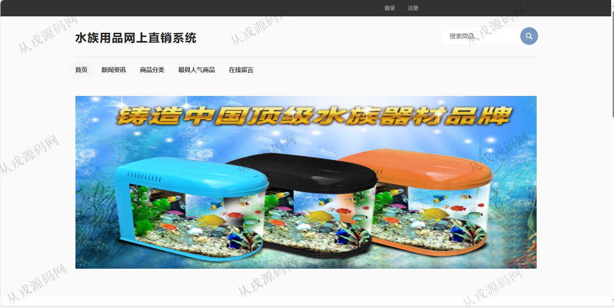

<h1 align="center">181.水族用品网上直销管理系统</h1>

 获取sql文件 QQ: 386869957 QQ群: 377586148 

 [更多源码项目: 从戎源码网](https://armycodes.com/) 

## 简介

> 本代码来源于网络,仅供学习参考使用!
>
> 提供1.远程部署/2.修改代码/3.设计文档指导/4.框架代码讲解等服务
> 
> 用户端访问地址：http://localhost:8080/onlineshopssm/
> 
> 用户：user 123456
> 
> 管理后台访问地址：http://localhost:8080/onlineshopssm/admin/login.jsp
> 
> 管理员：admin 123456
> 

## 项目介绍
基于ssm的水族用品网上直销管理系统：前端 jsp、jquery，后端 springmvc、spring、mybatis；角色分为管理员，用户；集成水族商品、购物车、在线购买、订单信息等功能于一体的系统。

## 功能介绍

### 用户

- 基本功能：登录，注册，退出
- 网站首页：主导航栏，轮播图，最新上架，最新新闻，全局搜索
- 水族商品：商品列表展示，分类导航，商品详情，收藏，购物车，在线结算，在线付款
- 订单信息：未完成订单查询，待收货订单查询，交易完成订单查询
- 其他功能：新闻资讯，帐户余额查询与充值，开通会员，收藏夹，在线留言

### 管理员

- 系统信息：关于我们，新增滚动图片，滚动图片列表查询，滚动图片删除
- 会员信息：用户在前台自行注册，后台管理员查看会员信息，搜索，删除会员
- 新闻信息：新闻信息的增删改查
- 类别管理：类别信息的增删改查
- 商品管理：商品信息的增删改查，商品图片上传
- 商品库存：商品库存信息查询，库存修改，搜索
- 订单管理：订单信息的列表查询，订单搜索，查看物流，订单删除
- 留言管理：留言信息查看与回复
- 退货管理：退货列表查询，退货记录搜索

## 环境

- <b>IntelliJ IDEA 2021.3</b>

- <b>Mysql 5.7.26</b>

- <b>Tomcat 7.0.73</b>

- <b>JDK 1.8</b>

## 运行截图

